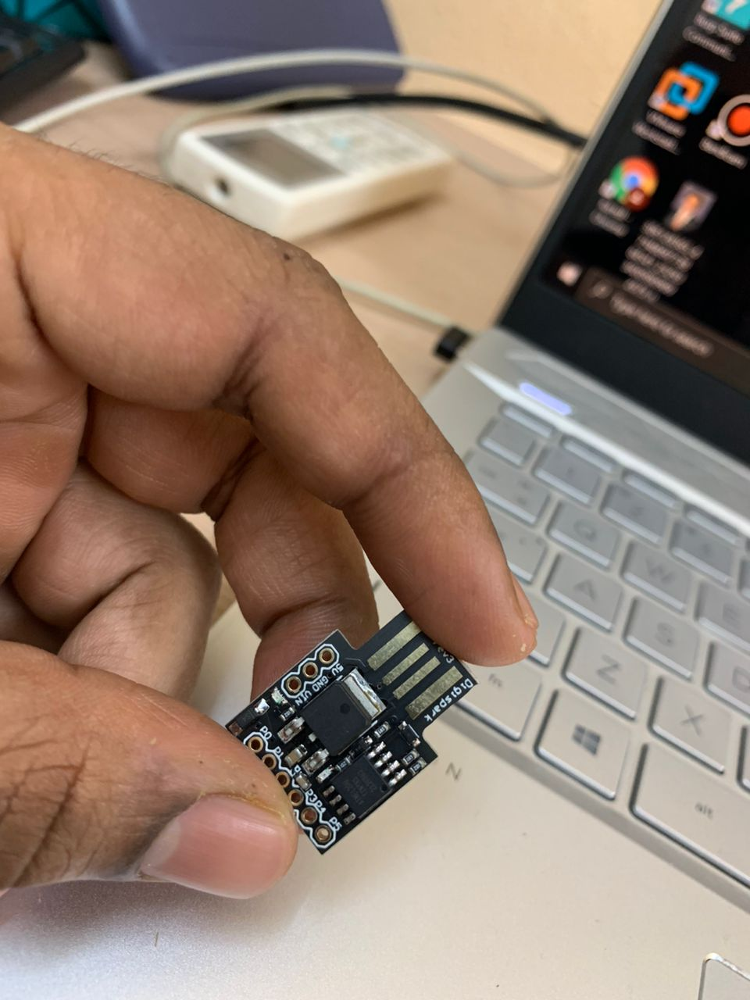
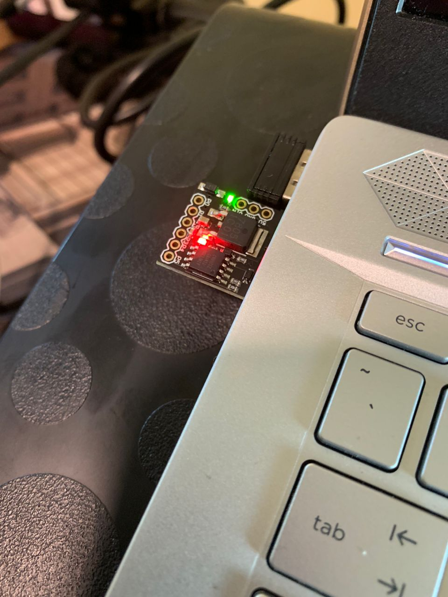
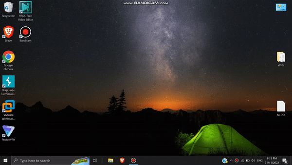

# Attiny-85-Payload-Deliver

This IC is meant to mimic devices like Rubber Ducky, Bash Bunny but lacks massively in utility. The limited memory space give us very little room to run massive payloads but this roughly demonstrates why we should never just randomly plug in a usb device we find on the ground. 

***USER DISCLAIMER***

**This is meant to be used as knowledge purposes only. The demo given is totally harmless given followed the given instructions. Any extensions or modifications from the demonstration is solely the individuals responsilibilty. Im not responsible for any of your actions.**

**Requirements**
1. [Digispark's Attiny85](https://my.cytron.io/p-digispark-attiny85-usb-a-arduino-compatible?r=1) 

2. [Arduino Software](https://www.arduino.cc/en/software)

**Steps**
1) Program your Attiny85 to so that code can be uploaded into the device. You can follow the tutorial from this [video](https://www.youtube.com/watch?v=MmDBvgrYGZs) .
2) Upload the code onto the IC. The IC should light up once the code is uploaded (can be deactivated in code).
3) Given the code is uploaded and all is good, once the IC is plugged in and payload is successful the IC will glow red and yellow. 

4) Now, you can start having fun by pranking some friends. Remember, dont use this knowledge for ill purposes.

**Demo**

This is a small demo of the process : 

 
 
 
 So that's all from me. You can definitely do a plethora of other things(both legal and illegal) using Attiny85 like InstantShell, BackDoor. Like they say, the sky is the limit. I would like to heavily emphasize again, ***DONT USE THIS WITH THE WRONG INTENTIONS***. So yeah, til we meet again, adios ((: 
